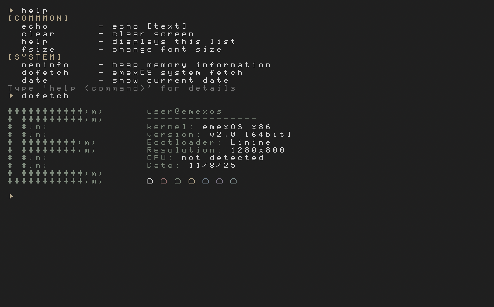

# emexOS - a simple 64 Bit OS written in C

#
 

## Build Dependencies
For building and compiling emexOS, ensure you have the following installed -
- x86_64 GCC cross-compiler - How you install this depends on your OS. Obviously this is the compiler for the OS code. emexOS only supports x86 64-bit machines for now but in the future it may support more architectures.
- [NASM](https://www.nasm.us/) - Assembler
- [QEMU](https://www.qemu.org/) - A system emulator used to emulate the OS. Very useful for testing and all.
- [Xorriso](https://www.gnu.org/software/xorriso/) - To create ISO files
- [Git](https://git-scm.com/) - Used to fetch dependencies

## For Nix Users
If you use [Nix](https://nixos.org/) then you can use the provided flake that includes all the required build dependencies so you can set up a development environment for emexOS out of the box with just a short and simple command.

## Building and Compiling
Now that you have all the required build dependencies installed, you can finally build and run emexOS.
- `make fetchDeps` - Fetches all libraries and such that emexOS depends on. Obviously `git` is used for this operation.
- `make` - Builds emexOS
- `make run` - Emulates emexOS using QEMU
- `make clean` - Cleans up all build outputs

 

# Commands

### Common

| command         | example         | output                       |
|-----------------|-----------------|------------------------------|
| echo            | echo text       | text                         |
| clear           | clear           | [clears screen]              |
| help <command>  | help echo       | [help menu/specific command] |
| fsize           | fsize 2         | [font size goes up to 2]     |

### System

| command         | example         | output                       |
|-----------------|-----------------|------------------------------|
| meminfo         | meminfo         | free memory: ...             |
| dofetch         | dofetch         | [emexOS logo, user, ...]     |
| date            | date            | [shows current date]         |

 

##
 - README.md by Voxi0 & emexSW
##
