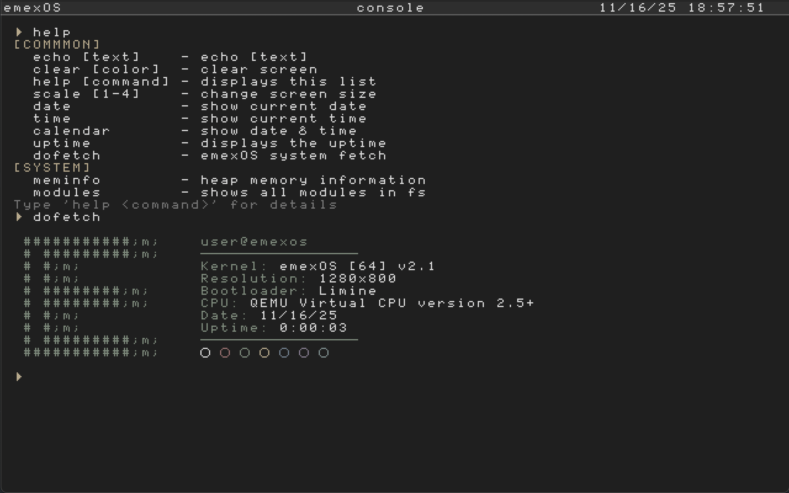

# emexOS - a simple 64 Bit OS written in C

## Build Dependencies
For building and compiling emexOS, ensure you have the following installed,
- x86_64 GCC cross-compiler - This is our preferred compiler for the source code. Currently, emexOS only supports 64-bit x86 machines, but we plan to support more architectures in the future.
- [NASM](https://www.nasm.us/) - Assembler.
- [QEMU](https://www.qemu.org/) - Our preferred emulator.
- [Xorriso](https://www.gnu.org/software/xorriso/) - ISO creation.
- [Git](https://git-scm.com/) - To fetch dependencies.

You can use Zig instead of x86_64-gcc if you prefer to,
- [Zig](https://ziglang.org/) - Zig lets you build the whole OS using just one command.

## For Nix Users
If you’re using [Nix](https://nixos.org/), you can run the provided flake that installs all the build dependencies. That way, you can set up a complete emexOS development environment with a single, simple command.

## Building and Compiling
Now that you have all the required build dependencies installed, you can finally build and run emexOS.

**Using gnu-make**
- `make fetchDeps` - Fetches all libraries and such that emexOS depends on. Obviously `git` is used for this operation.
- `make` - Builds emexOS.
- `make run` - Emulates emexOS using QEMU.
- `make clean` - Cleans up all build outputs.

**Using Zig**
- `zig build` - Fetch, build and run.
- `zig build -Dnofetch` - Build and run.
- `zig build -Dclean` - Remove (cache, output), fetch, build and run.
- `zig build -Dnofetch -Dclean` - Remove (cache, output), build and run.

## Commands

### Common

| command         | example         | output                       |
|-----------------|-----------------|------------------------------|
| echo            | echo text       | text                         |
| clear           | clear           | [clears screen]              |
| help <command>  | help echo       | [help menu/specific command] |
| scale           | scale 3         | [font size from 1 to 4]      |
| date            | date            | [shows current date]         |
| calendar        | calendar        | [shows current date & time]  |
| time            | time            | [shows current time]         |
| uptime          | uptime          | [shows current uptime]       |

### System

| command         | example         | output                       |
|-----------------|-----------------|------------------------------|
| meminfo         | meminfo         | free memory: ...             |
| dofetch         | dofetch         | [emexOS logo, user, ...]     |
| date            | date            | [shows current date]         |

---

## License:
- GNU GPLv3
- Attribution required (see ATTRIBUTION.md)

## Writer
 - README.md by Voxi0 & emexSW & Bi Moz
 - emexOS project started by emexSW
##

